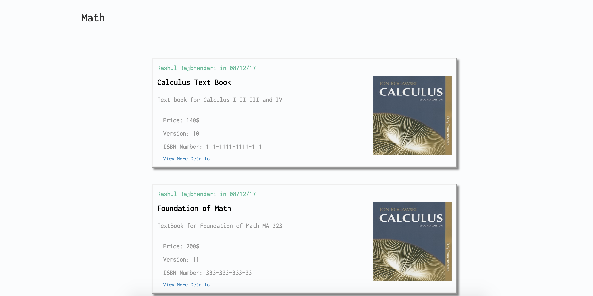

About:

Built a book selling web application targeted for Caldwell University students. 
Implemented Google Sign-In and secure api endpoints for CRUD items for sale and contacting the seller.

1. Sign-In via Google
2. Creating, Updating, Deleting Book Items for Sale
3. An email is sent out to the seller, if a buyer is interested in the item. 

Technologies Used:

Mongodb
Express
Angular.js
Nodejs

   

   

